# Fiscaly

Field inspection management system built for a labor union's compliance department. Replaces a manual, paper-based process with a full-stack web app that handles inspection tracking, automated document generation, email dispatch, and AI-powered data extraction.

> **Privacy notice:** This repository contains the full technical implementation. All screenshots use synthetic data. No real enterprise, taxpayer, or union member data is included anywhere in this repo.

---

## What it does

Labor inspectors visit companies to verify union compliance. Before Fiscaly, each inspection required manually typing company data, writing notification letters by hand, and sending emails one by one. The process took ~10 minutes per company.

Fiscaly reduces that to under 2 minutes by:

1. **Extracting data automatically from scanned documents** (FiscAI) — inspector photographs or scans a paper form, the AI reads it and pre-fills the entire inspection form
2. **Generating the notification document** (Word .docx) pre-populated with company-specific data
3. **Sending the notification email** directly from the app, with the generated document attached, in one click
4. **Tracking inspection status** across the full workflow: from field visit → union review → liquidation → acta generation

---

## Screenshots

| Dashboard | Inspection table |
|-----------|-----------------|
| 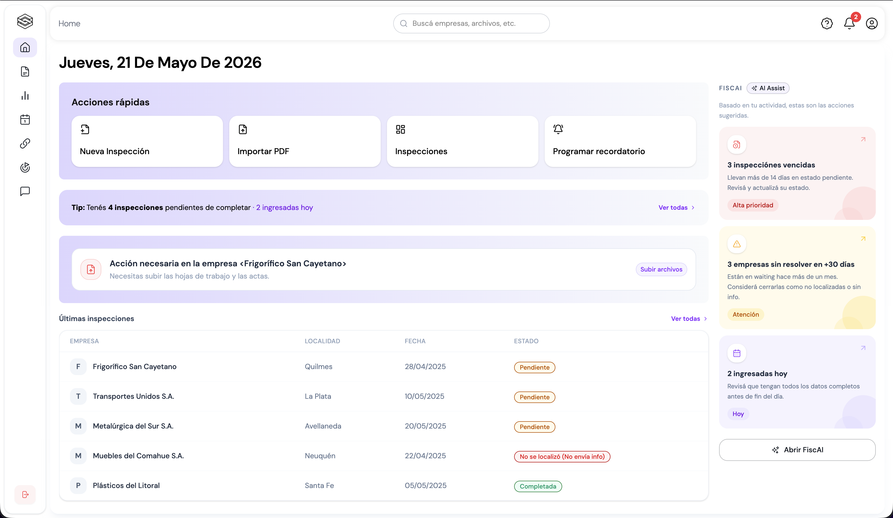 | 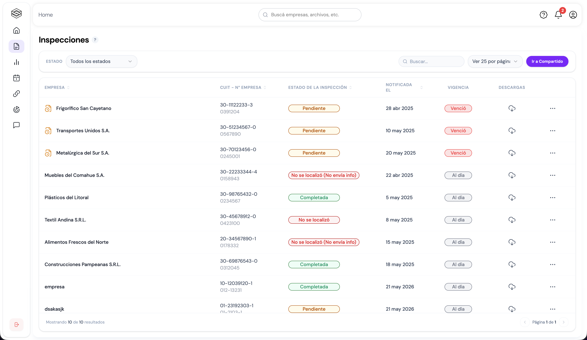 |

| Inspection detail | Email composer |
|-------------------|----------------|
| 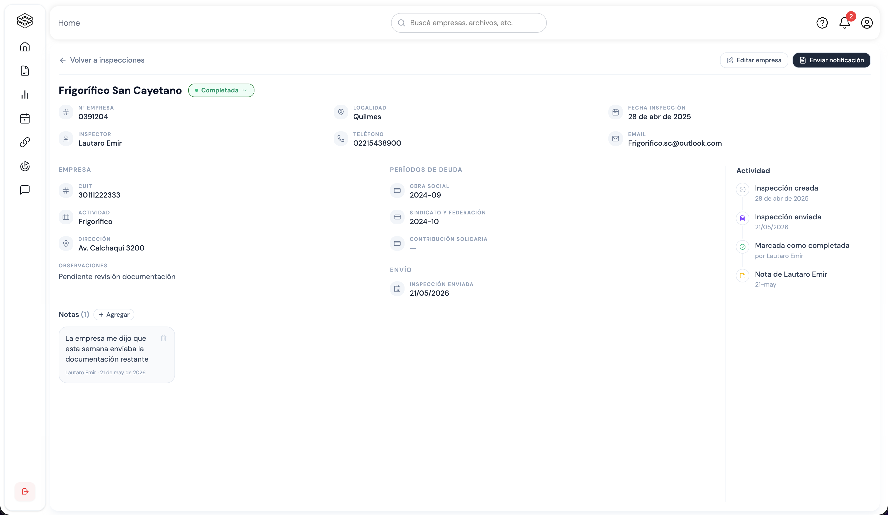 | 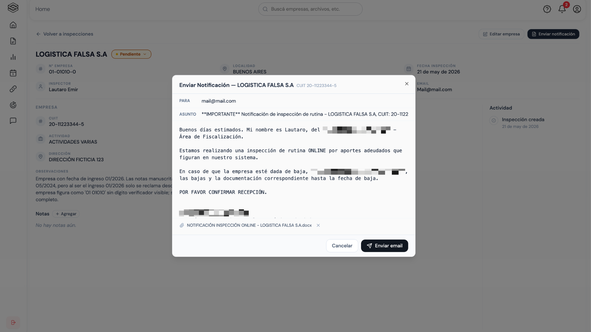 |

| Add inspection (manual) | Document download |
|-------------------------|-------------------|
| 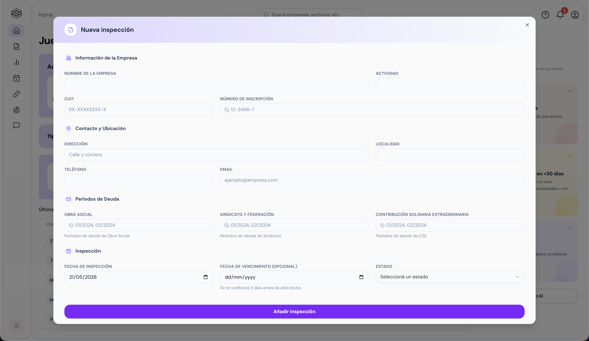 | 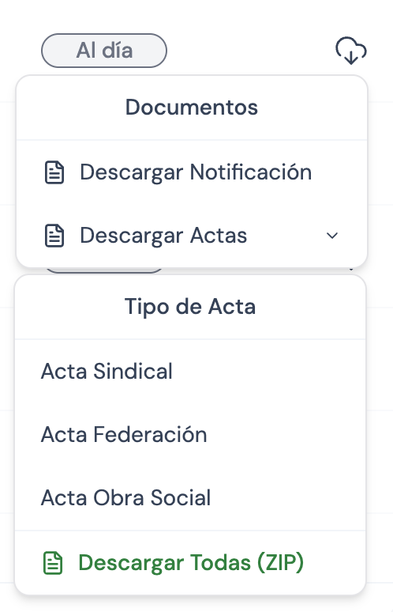 |

| Reminders | 
|-----------|
| 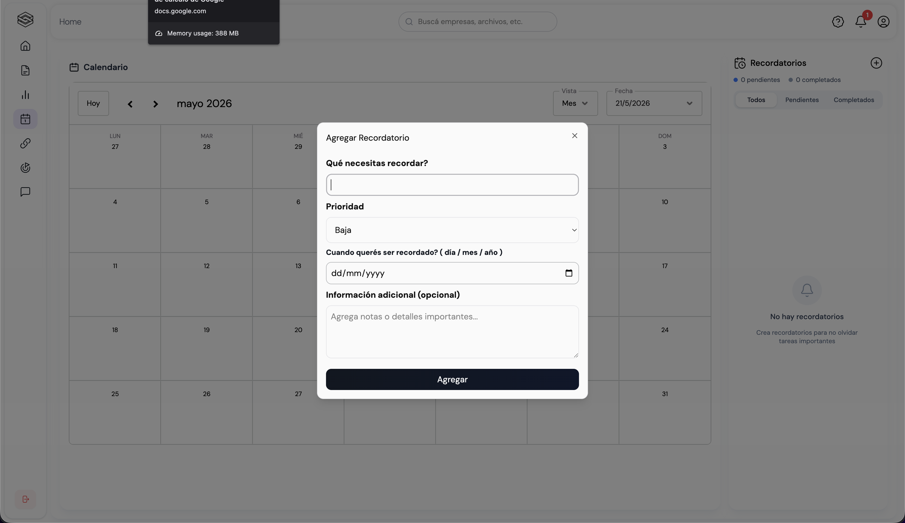

### FiscAI workflow

The full flow runs from a phone camera to a pre-filled form in under 30 seconds.

| 1. Mobile — take photo | 2. Camera aimed at document | 3. Mobile — form pre-filled |
|------------------------|-----------------------------|-----------------------------|
| 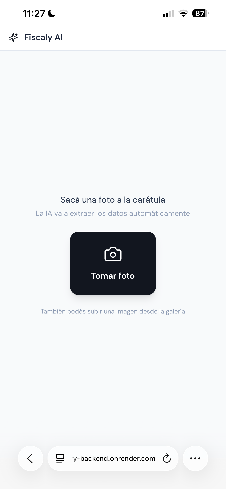 | 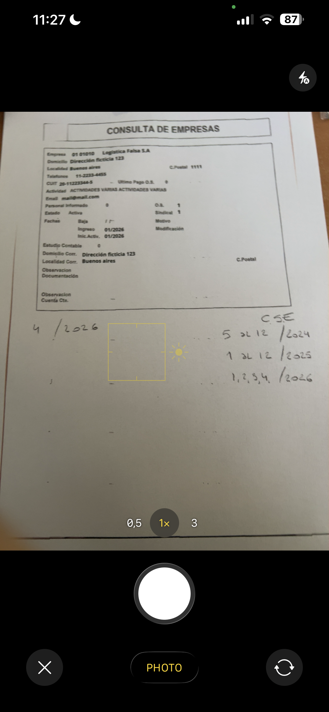 | 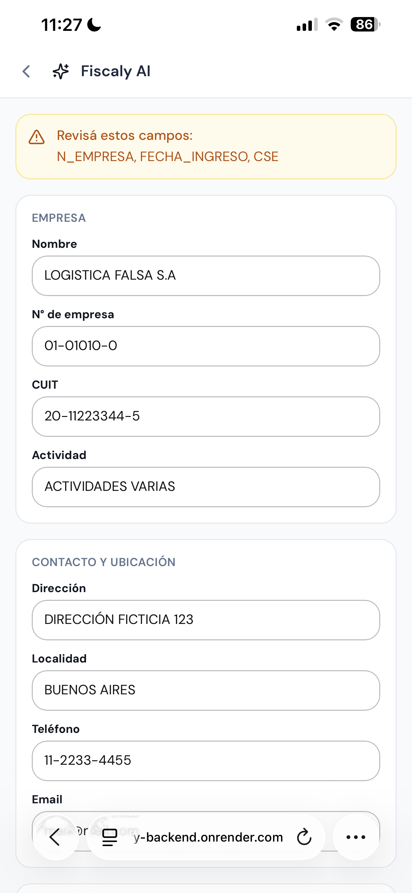 |

| 4. Desktop — drag & drop upload | Source document |
|---------------------------------|-----------------|
| 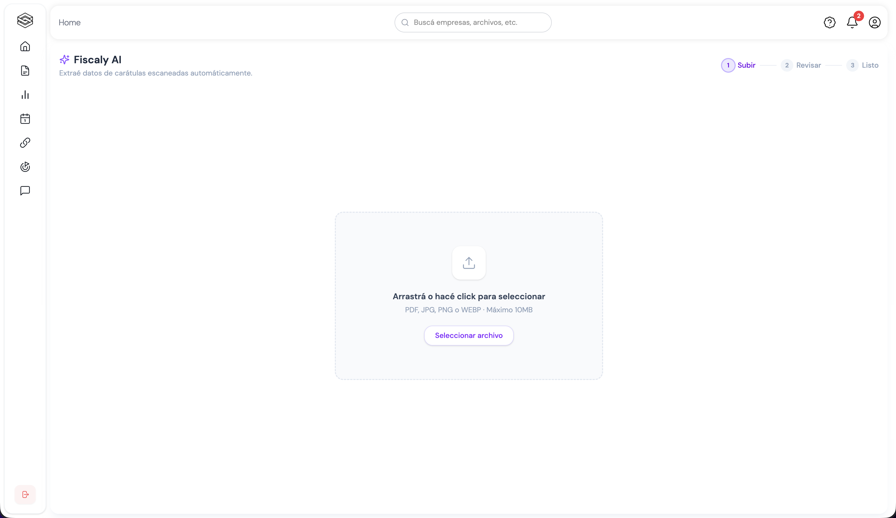 | 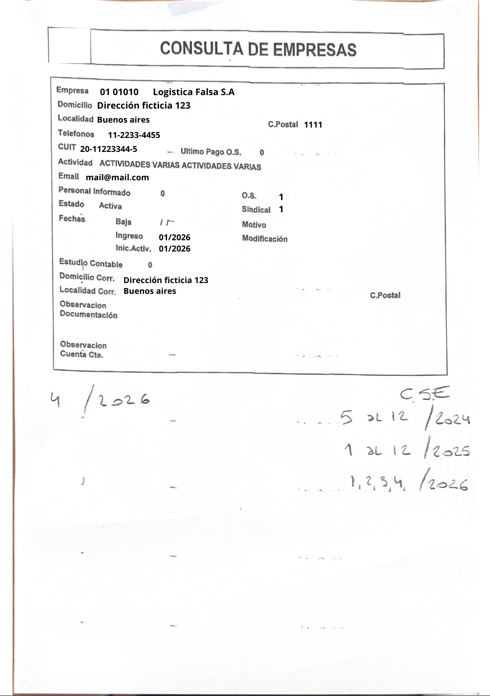 |

---

## Tech stack

| Layer | Tech |
|-------|------|
| Frontend | React 19, TypeScript, Vite, TailwindCSS, Radix UI |
| Backend | Node.js, Express, TypeScript (`tsx`) |
| Database | PostgreSQL via Prisma ORM |
| Auth | JWT (access + refresh tokens), HTTP-only cookies, CSRF protection |
| AI | Claude API (Anthropic) — `claude-sonnet-4-6` |
| Email | Nodemailer + Gmail |
| Doc generation | docx (Word) |
| Containerization | Docker (PostgreSQL on port 5433) |

---

## Key features

### FiscAI — AI-powered data extraction

Inspectors work with physical paper forms. FiscAI accepts a photo or scanned PDF of that form and returns a structured JSON that pre-fills the entire inspection form — no manual typing.

The system prompt encodes domain-specific business rules: statute of limitations periods (5 years for union contributions, starting 05/2023 for solidarity contributions), dynamic reference date calculation, and debt period formatting rules. Claude returns a structured JSON and flags ambiguous fields for human review.

For low-quality images (reprinted, re-scanned documents), images are pre-processed with Sharp before sending to the API: grayscale + normalize + sharpen + resize to 2400px wide.

```typescript
// Dynamic reference date calculation — the "last integrated month"
// depends on whether we're before or after the 15th of the current month
const lastIntegratedMonth = new Date(
  now.getFullYear(),
  day >= 15 ? now.getMonth() - 1 : now.getMonth() - 2,
  1
)
```

**Result:** 10 min → under 2 min per inspection.

---

### Automated email dispatch

From the inspection detail view, one click opens a pre-composed email:

- **To:** pre-filled from the company record
- **Subject:** auto-generated with company name and tax ID (CUIT)
- **Body:** notification letter template filled with company-specific data (debt periods, inspector contact, etc.)
- **Attachment:** a Word document generated on the fly from a template, also pre-filled with company data

The DOCX is generated in the background while the dialog opens, so by the time the inspector reads the pre-filled email, the attachment is ready.

```typescript
// Email composer — parallel async: body text + DOCX attachment
// generated simultaneously when the dialog opens
useEffect(() => {
  if (!open) return
  setTo(enterprise.email ?? '')
  // Generate email body
  import('../../services/docxService').then(({ generateEmailOnly, generateEmailHtml }) => {
    setBody(generateEmailOnly(enterprise))
    setBodyHtml(generateEmailHtml(enterprise, phone))
  })
  // Generate DOCX attachment in parallel
  setIsGeneratingDoc(true)
  import('../../services/docxService').then(({ generateInspectionNotificationBlob }) => {
    generateInspectionNotificationBlob({ enterprise }).then((blob) => {
      // convert to base64 for transport
      const reader = new FileReader()
      reader.onloadend = () => {
        const base64 = (reader.result as string).split(',')[1]
        setAttachment({ filename: `NOTIFICACIÓN INSPECCIÓN - ${enterprise.name}.docx`, content: base64 })
        setIsGeneratingDoc(false)
      }
      reader.readAsDataURL(blob)
    })
  })
}, [open, enterprise])
```

---

### Role-based access control

Four roles with distinct access scopes:

| Role | Access |
|------|--------|
| `fiscalizador` | Own inspections only |
| `admin` | All inspections in the fiscalization module |
| `liquidador` | Isolated liquidation module only |
| `superadmin` | Full system access |

Roles are enforced at the middleware level on every route. The liquidation module is entirely separate — liquidadores never see raw inspection data, only the structured requests sent to them.

---

### Inspection workflow

```
Field visit
    └─▶ Create inspection (manual or via FiscAI)
            └─▶ Send notification email
                    └─▶ Submit to liquidation
                            └─▶ Liquidador assigns, processes, generates acta
                                    └─▶ Completed — acta number recorded
```

Each state transition is logged in `ActivityLog` with the user, timestamp, old value, and new value.

---

### Security

- JWT access tokens (short-lived) + refresh tokens stored in DB with revocation support
- Tokens delivered via HTTP-only cookies — not accessible to JavaScript
- CSRF protection on all state-changing requests
- Rate limiting middleware on auth endpoints
- Zod schema validation on all API inputs
- File upload validation: MIME type + extension check, temp file cleanup on error

---

## Data model highlights

The schema was designed around the domain's real constraints:

- **Enterprise ID as string** — union company numbers like `02-45002-1` have leading zeros that would be destroyed by an integer primary key
- **CUIT as string** — stored without hyphens in the DB, formatted with hyphens in the UI (`formatCuit()`)
- **Debt as JSON string** — `{ OS, sindicate, cse }` — three independent debt periods that each follow different prescription rules, stored together but validated separately
- **`statusChangedAt`** — enables weekly progress reports filtered by when status actually changed, not when the record was created

---

## Project structure

```
fiscapp/                     # React frontend
├── src/
│   ├── features/
│   │   └── fiscalization/   # Main domain feature
│   │       ├── pages/       # Route-level components
│   │       ├── components/  # Feature-specific components
│   │       └── hooks/       # Data fetching, table columns
│   └── shared/
│       ├── components/ui/   # Reusable UI (dialogs, tables)
│       ├── context/         # EnterpriseContext
│       ├── services/api/    # API client wrappers
│       └── hooks/           # useFormEnterprises, useAuth

fiscapp-backend/             # Express backend
├── src/
│   ├── controllers/         # Route handlers
│   ├── services/            # Business logic (email, acta, notifications)
│   ├── middleware/          # Auth, RBAC, rate limiting, CSRF
│   ├── routes/              # Express routers
│   └── jobs/                # Scheduled jobs (reminder checks)
└── prisma/
    └── schema.prisma        # 10-model schema
```

---

## Running locally

```bash
# Start the database
docker-compose up -d

# Backend
cd fiscapp-backend
cp .env.development .env
npm install
npm run dev

# Frontend
cd fiscapp
npm install
npm run dev
```

Requires: `ANTHROPIC_API_KEY`, `GMAIL_USER`, `GMAIL_APP_PASSWORD` in `fiscapp-backend/.env.development`.

---

## What I'd do differently

- The `debt` field as a JSON string was a pragmatic choice to avoid a many-to-many table early on. With more time I'd normalize it into a proper `DebtPeriod` model.
- The FiscAI system prompt is embedded in the controller. It should be in a versioned config or prompt file to allow iteration without a deploy.
- No integration tests on the email flow — the nodemailer mock and real Gmail config have diverged before, and that's a real risk.
